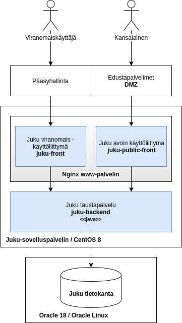

Juku
====

JUKU on joukkoliikenteen rahoitus-, kustannus- ja suoritetietojen keräys- ja seurantajärjestelmä. 
JUKU -järjestelmällä kunnat ja ELY-keskukset hakevat tukea julkisen liikenteen järjestämiseen ja viranomainen käsittelee tukihakemuksia. 
Järjestelmällä kerätään myös joukkoliikenteeseen liittyviä tunnuslukuja. 

Järjestelmä muodostuu:
- Käyttöliittymistä eri sidosryhmille
- Sovelluskerroksesta
- Tietokannasta

Sovelluskerros
--------------
Sovelluskerros sisältää komponentit:
- [juku-backend](/juku-backend) - julkiset ja viranomaisille suunnatut taustapalvelut
- [juku-db](/juku-db) - tietokannan migraatiotyökalu

Käyttöliittymät
---------------

Viranomaiskäyttöliittymä: https://github.com/solita/livijuku-front

Julkinen käyttöliittymä: https://github.com/solita/livijuku-public-front

Kehitysympäristön käynnistäminen
--------------------------------

Asenna [java][java], [docker][docker] ja [leiningen][leiningen].

Käynnistä [tietokanta](/juku-db/docker)

    cd juku-db/docker
    less README.md

Luo [skeema](/juku-db) tietokantaan

    cd juku-db
	lein with-profiles +test-data do clear-db, update-db

Käynnistä [backend-palvelu](/juku-backend)

    cd juku-backend
    lein ring server-headless

Muut ympäristöt
---

Jukun avoin lähdekoodiosa ei kiinnitä tuotantoympäristön arkkitehtuuria. 
Alla olevassa kuvassa on esimerkki siitä miltä tuotantoympäristö voisi näyttää:

Komponenttien asennus voidaan kuitenkin tehdä usealla eri tavalla esim. 
- käyttöympäristö voidaan kahdentaa
- avointa puolta voidaan ajaa omalla palvelimella
- käyttöliittymien jakeluun voidaan käyttää mitä tahansa www-palvelinta esim. apache tai lighttpd

Järjestelmä tarvitsee (jukun komponenttien) lisäksi seuraavat palvelut:
- Pääsyhallinta - jukussa ei ole omaa pääsyhallintaa
- WWW-palvelin - käyttöliittymät tarvitsevat erillisen www-palvelimen
- Oracle-tietokanta
- Sähköpostipalvelu (smtp)

[java]: https://openjdk.java.net/
[docker]: https://www.docker.com/
[leiningen]: https://leiningen.org/
